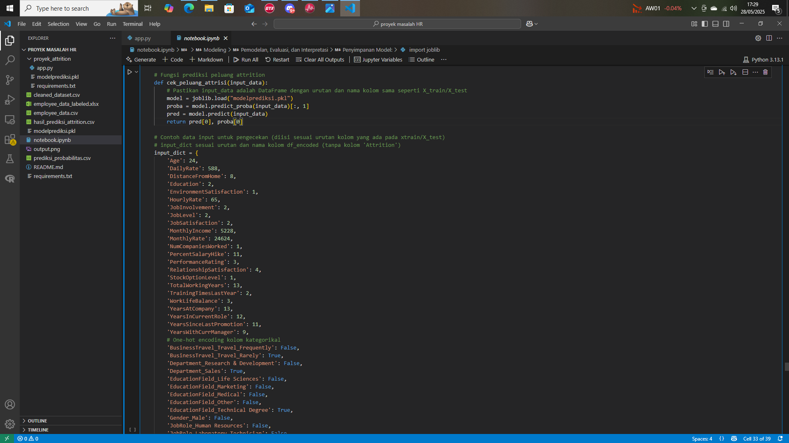

# Proyek Akhir: Menyelesaikan Permasalahan Perusahaan Edutech

## Business Understanding
Jaya Jaya Maju adalah perusahaan multinasional dengan lebih dari 1.000 karyawan. Meskipun perusahaan telah berkembang pesat, mereka mengalami attrition rate yang tinggi (>10%). Ini menunjukkan ada masalah pada retensi karyawan, yang bisa berdampak pada produktivitas, biaya pelatihan, serta semangat kerja tim yang tersisa. Hal ini perlu dianalisa untuk mengetahui masalah dalam manajemen sumber daya manusia.

### Permasalahan Bisnis
Meskipun Jaya Jaya Maju telah berkembang menjadi perusahaan multinasional dengan lebih dari 1.000 karyawan, perusahaan menghadapi tantangan serius dalam manajemen sumber daya manusia, khususnya terkait dengan tingginya tingkat attrition (employee turnover) yang mencapai lebih dari 10%.
Tingginya angka attrition ini menunjukkan adanya potensi permasalahan internal seperti:
- Ketidakpuasan kerja
- Beban kerja yang berlebihan
- Kurangnya peluang pengembangan karier
- Ketidaksesuaian kompensasi
- Masalah budaya kerja dan manajerial
- Permasalahan ini berdampak negatif pada:
- Biaya rekrutmen dan pelatihan ulang karyawan baru
- Penurunan produktivitas tim
- Hilangnya pengetahuan dan keterampilan penting
- Ketidakstabilan dalam operasional perusahaan

### Cakupan Proyek
- Mengidentifikasi faktor-faktor utama penyebab tingginya attrition rate.
-  Mengambil keputusan berbasis data untuk menurunkan tingkat turnover.
- Memonitor berbagai indikator karyawan melalui business dashboard agar bisa melakukan intervensi lebih dini.
- Melakukan analisis eksploratif terhadap data karyawan.
- Membangun model prediktif untuk mengidentifikasi karyawan yang berpotensi resign.
- Menyediakan visualisasi interaktif untuk monitoring HR metrics secara real-time.

### Persiapan

Sumber data: https://github.com/dicodingacademy+/dicoding_dataset/tree/main/employee 

Setup environment:

Instalasi environment yang diperlukan
pip install -r requirements.txt 

menjalankan script prediksi
bisa langsung di notebook ipynb pada bagian
# Fungsi prediksi peluang attrition 

atau 
akses secara online pada
https://prediksiatrisi.streamlit.app/

## Business Dashboard

Link: https://lookerstudio.google.com/reporting/7a582316-1691-41cb-88e8-e9b4075ee39b

Business dashboard yang telah dikembangkan memberikan gambaran menyeluruh dan interaktif mengenai kondisi karyawan di perusahaan Jaya Jaya Maju. Dashboard ini dirancang untuk membantu manajemen dalam memahami tren dan pola attrition, serta mengidentifikasi faktor-faktor yang memengaruhi keputusan karyawan untuk keluar dari perusahaan.

Fitur dan Informasi yang Disajikan:
- Perbandingan persentase attrisi secara umum
- Attrisi berdasar opsi kepemilikan saham
- Attrisi berdasar Gender beserta persentasenya
- Attrisi berdasar Pendidikan
- Attrisi berdasar Kepuasan Kenyamanan Tempat Kerja
- Attrisi berdasar Overtime dan Departement
- Attrisi berdasar Job Involvement
- Attrisi berdasar Tahun Pengalaman Kerja
- Attrisi berdasar Status Pernikahan
- Attrisi berdasar Kelompok Usia
- Serta Hasil Analisa Berdasar Model Machine Learning

## Conclusion

Berdasarkan grafik hasil model **Random Forest**, dapat disimpulkan bahwa:
1. **Faktor paling dominan yang memengaruhi kemungkinan karyawan keluar dari perusahaan adalah lembur (OverTime_Yes)**. Karyawan yang sering lembur memiliki risiko resign yang jauh lebih tinggi.
2. **Faktor kompensasi non-gaji seperti StockOptionLevel (opsi saham)** juga berpengaruh kuat. Karyawan dengan level opsi saham yang rendah cenderung lebih mudah keluar.
3. **Faktor jabatan (JobLevel)** menunjukkan bahwa karyawan dengan level rendah lebih berisiko keluar, menunjukkan pentingnya jenjang karier.
4. **Kepuasan terhadap lingkungan kerja dan pekerjaan (EnvironmentSatisfaction & JobSatisfaction)** termasuk dalam 5 besar faktor penting, mengindikasikan bahwa kondisi kerja sangat memengaruhi retensi.
5. **Keterlibatan kerja (JobInvolvement)**, **status lajang (MaritalStatus_Single)**, serta **penghasilan bulanan (MonthlyIncome)** juga termasuk penentu penting dalam keputusan keluar.
6. **Lama bekerja (YearsAtCompany)** dan **usia (Age)** memiliki peran yang signifikan. Karyawan yang masih muda atau baru bekerja cenderung lebih rentan keluar.

### Insight Utama:
**Attrition bukan hanya persoalan gaji**, tetapi lebih dipengaruhi oleh keseimbangan kerja, kepuasan psikologis, dan hubungan emosional karyawan terhadap pekerjaan dan perusahaan.
Perusahaan dapat secara proaktif menurunkan tingkat attrition dengan fokus pada faktor-faktor utama tersebut.

### Rekomendasi Action Items (Optional)

## Rekomendasi Action Items untuk Menurunkan Attrition
Berikut adalah daftar tindakan strategis berbasis data yang dapat diimplementasikan oleh HR dan manajemen Jaya Jaya Maju untuk mengurangi tingkat attrition:
1. Kendalikan Beban Lembur
- Evaluasi ulang kebijakan lembur.
- Buat batasan maksimal jam lembur per minggu.
- Implementasikan sistem monitoring beban kerja harian.

2. Optimalkan Program Opsi Saham
- Tinjau distribusi StockOptionLevel secara adil.
- Perluas akses opsi saham untuk karyawan berpotensi tinggi.
- Komunikasikan manfaat jangka panjang kepemilikan saham.

3. Kembangkan Jalur Karier yang Jelas
- Buat roadmap kenaikan jabatan berbasis kinerja.
- Sediakan program pelatihan & sertifikasi internal.
- Rotasi kerja untuk memperluas pengalaman antar-departemen.

4. Tingkatkan Kepuasan Kerja
- Lakukan survei kepuasan kerja minimal 2x setahun.
- Tindak lanjuti hasil survei dengan program perbaikan.
- Perkuat komunikasi dua arah antara manajemen dan karyawan.

5. Dorong Keterlibatan Karyawan
- Implementasi program penghargaan dan pengakuan (employee recognition).
- Bentuk tim proyek lintas fungsi (cross-functional taskforce).
- Dorong karyawan berpartisipasi dalam pengambilan keputusan operasional.

6. Fokus pada Karyawan Lajang & Usia Muda
- Tawarkan career coaching dan mentoring personal.
- Sediakan kegiatan sosial internal untuk meningkatkan sense of belonging.
- Ciptakan komunitas karyawan muda untuk saling mendukung.

7. Gunakan Dashboard Pemantauan Attrition
- Integrasikan model prediksi ke dalam dashboard HR.
- Tampilkan metrik risiko attrition untuk tiap segmen karyawan.
- Buat notifikasi dini untuk HR jika terdapat kenaikan risiko kelompok tertentu.
